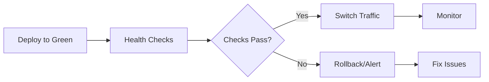

# 🔵🟢 Blue/Green Deployment Guide

## Overview

Blue/Green deployment enables **zero-downtime deployments** with instant rollback capability.

### Concept

-   **Blue Environment**: Current production (stable, serving users)
-   **Green Environment**: New version (deployed in parallel, not yet live)
-   **Traffic Switch**: Instantly route users from Blue → Green after health checks pass
-   **Rollback**: If issues arise, instantly switch back to Blue

---

## 🏗️ Architecture

```
┌─────────────────────────────────────────────────┐
│           Cloudflare DNS / Load Balancer       │
│              (api.advancia.com)                 │
└────────────────┬────────────────────────────────┘
                 │
                 ├──────────────┬─────────────────┐
                 │              │                 │
         ┌───────▼──────┐  ┌───▼─────────┐      │
         │  🔵 Blue      │  │  🟢 Green   │      │
         │  Environment  │  │  Environment│      │
         │              │  │             │      │
         │  Droplet 1   │  │  Droplet 2  │      │
         │  (Current)   │  │  (New)      │      │
         └──────────────┘  └─────────────┘      │
                                                 │
                        Traffic switches here ───┘
```

---

## 🚀 Deployment Workflows

### 1. Blue/Green Deployment Workflow

**File:** `.github/workflows/blue-green-deployment.yml`

**Triggers:**

-   Manual dispatch via GitHub Actions UI
-   Choose target environment (Blue or Green)
-   Option for automatic traffic switch

**Steps:**

1. Deploy to target environment
2. Run comprehensive health checks
3. Optionally switch traffic automatically
4. Send Slack notifications
5. Automatic rollback on failure

**Usage:**

```bash
# In GitHub Actions UI:
1. Go to Actions → Blue/Green Production Deployment
2. Click "Run workflow"
3. Select environment (green/blue)
4. Choose auto-switch (true/false)
5. Run workflow
```

### 2. Manual Traffic Switch

**File:** `.github/workflows/manual-traffic-switch.yml`

**Purpose:** Manually switch production traffic between environments

**Usage:**

```bash
# In GitHub Actions UI:
1. Go to Actions → Manual Traffic Switch
2. Click "Run workflow"
3. Select target environment
4. Provide reason
5. Run workflow
```

### 3. Emergency Rollback

**File:** `.github/workflows/emergency-rollback.yml`

**Purpose:** Instant rollback in case of production issues

**Usage:**

```bash
# In GitHub Actions UI:
1. Go to Actions → Emergency Rollback
2. Click "Run workflow"
3. Provide reason
4. Enable notifications
5. Run workflow
```

---

## 📋 Required GitHub Secrets

### DigitalOcean Droplets

```bash
DROPLET_IP_BLUE=XXX.XXX.XXX.XXX      # Blue environment IP
DROPLET_IP_GREEN=XXX.XXX.XXX.XXX     # Green environment IP
DROPLET_SSH_KEY_PROD=<SSH_PRIVATE_KEY>
DROPLET_USER_PROD=root
```

### Cloudflare DNS

```bash
CF_ZONE_ID=<your_zone_id>
CF_API_TOKEN=<your_api_token>
CF_PROD_RECORD_ID=<dns_record_id_for_api>
CF_WWW_RECORD_ID=<dns_record_id_for_www>
```

### Notifications

```bash
SLACK_WEBHOOK_URL=https://hooks.slack.com/services/...
```

---

## 🎯 Deployment Strategy

### Initial Setup

1. **Deploy to Blue (Production)**

   ```bash
   # Blue is your current production
   # Users are accessing: api.advancia.com → Blue Droplet
   ```

2. **Deploy to Green (Staging/New)**

   ```bash
   # Deploy new version to Green
   # Run health checks
   # Green is accessible at: green.advancia.com
   ```

3. **Switch Traffic**

   ```bash
   # After successful health checks
   # Update DNS: api.advancia.com → Green Droplet
   # Blue remains as rollback target
   ```

### Normal Deployment Flow



### Next Deployment

```bash
# Now Green is production
# Deploy new version to Blue
# Run health checks on Blue
# Switch traffic: api.advancia.com → Blue
# Green becomes rollback target
```

---

## 🧪 Health Checks

### Automated Checks

1. **Backend API Health**

   ```bash
   GET /api/health
   Expected: { "status": "ok" }
   ```

2. **Frontend Health**

   ```bash
   GET /
   Expected: HTTP 200
   ```

3. **Database Connectivity**

   ```bash
   GET /api/health/db
   Expected: { "database": "connected" }
   ```

4. **Redis Connectivity**

   ```bash
   GET /api/health/redis
   Expected: { "redis": "connected" }
   ```

### Health Check Settings

```yaml
HEALTH_CHECK_TIMEOUT: 300 seconds
HEALTH_CHECK_INTERVAL: 10 seconds
MAX_ATTEMPTS: 30
```

---

## 🔄 Rollback Procedures

### Automatic Rollback

-   Triggered on deployment failure
-   Triggered on health check failure
-   DNS points back to stable environment
-   Team notified via Slack

### Manual Rollback

1. Use Emergency Rollback workflow
2. Or use Manual Traffic Switch
3. Select previous stable environment
4. Execute switch

### Rollback Time

-   **DNS Switch**: ~30-60 seconds
-   **Total Downtime**: 0 seconds (Blue stays live during Green deployment)

---

## 📊 Monitoring After Deployment

### Key Metrics to Watch

1. **Error Rate**
   -   Monitor for spike in errors
   -   Alert threshold: >2%

2. **Response Time**
   -   Monitor API response times
   -   Alert threshold: >500ms

3. **Traffic**
   -   Verify traffic shifted correctly
   -   Compare request volumes

4. **Resource Usage**
   -   CPU and memory usage
   -   Database connections

### Monitoring Tools

-   Prometheus dashboards
-   Grafana alerts
-   Sentry error tracking
-   Slack notifications

---

## 🛠️ Server Setup

### Blue Environment

```bash
# Server: droplet-blue
# IP: DROPLET_IP_BLUE
# Domain: blue.advancia.com (for direct access)
# Purpose: Production or Rollback

ssh root@$DROPLET_IP_BLUE
cd /app
pm2 status
```

### Green Environment

```bash
# Server: droplet-green
# IP: DROPLET_IP_GREEN
# Domain: green.advancia.com (for direct access)
# Purpose: New deployment or Rollback

ssh root@$DROPLET_IP_GREEN
cd /app
pm2 status
```

### Required Setup on Each Droplet

```bash
# 1. Install dependencies
apt update && apt install -y git nodejs npm

# 2. Clone repository
git clone https://github.com/muchaeljohn739337-cloud/-modular-saas-platform.git /app

# 3. Install PM2
npm install -g pm2

# 4. Setup application
cd /app/backend && npm ci
cd /app/frontend && npm ci && npm run build

# 5. Configure environment
cp .env.example .env.production
# Edit .env.production with production values

# 6. Setup PM2 ecosystem
pm2 start ecosystem.config.js
pm2 save
pm2 startup
```

---

## 🔐 Security Considerations

1. **SSH Keys**
   -   Use separate SSH keys for Blue/Green
   -   Rotate keys regularly
   -   Store securely in GitHub Secrets

2. **Environment Variables**
   -   Different secrets for Blue/Green if needed
   -   Never commit secrets to repository

3. **Database**
   -   Shared database between Blue/Green
   -   Run migrations carefully
   -   Test migrations on staging first

4. **DNS TTL**
   -   Keep TTL low (60-120s) for fast switches
   -   Cloudflare proxying for DDoS protection

---

## 📝 Pre-Deployment Checklist

-   [ ] Both environments (Blue & Green) set up
-   [ ] GitHub Secrets configured
-   [ ] Cloudflare DNS records created
-   [ ] SSH access verified to both droplets
-   [ ] PM2 configured on both servers
-   [ ] Health check endpoints working
-   [ ] Slack webhook configured
-   [ ] Database migrations tested
-   [ ] Backup procedures in place
-   [ ] Monitoring dashboards ready

---

## 🎯 Deployment Examples

### Example 1: Deploy New Feature

```bash
# Current: Blue is production

1. Deploy to Green:
   - Run: Blue/Green Deployment workflow
   - Target: Green
   - Auto-switch: false

2. Test Green:
   - Visit: https://green.advancia.com
   - Run smoke tests
   - Verify features

3. Switch Traffic:
   - Run: Manual Traffic Switch
   - Target: Green
   - Reason: "Deploy feature XYZ"

4. Monitor:
   - Watch Grafana dashboards
   - Check Sentry for errors
   - Verify user traffic

# Now: Green is production, Blue is rollback
```

### Example 2: Hotfix Deployment

```bash
# Current: Green is production
# Issue: Critical bug in production

1. Fix in Blue:
   - Deploy hotfix to Blue
   - Auto-switch: true (immediate)

2. Automatic:
   - Health checks run
   - Traffic switches automatically
   - Notification sent

3. If fails:
   - Automatic rollback to Green
   - Team alerted

# Result: Fast hotfix deployment
```

### Example 3: Emergency Rollback

```bash
# Current: Green is production
# Issue: Major bug discovered

1. Execute Emergency Rollback:
   - Run: Emergency Rollback workflow
   - Reason: "Critical bug in payment flow"
   - Notify: true

2. Automatic:
   - DNS switches to Blue
   - Team notified urgently
   - Incident report created

3. Follow-up:
   - Investigate issue in Green
   - Fix bug
   - Redeploy when ready

# Result: Users back on stable version
```

---

## 🚦 Traffic Switch Process

### Cloudflare DNS Update

```bash
# What happens during traffic switch:

1. Current state:
   api.advancia.com → 1.2.3.4 (Blue)

2. API call to Cloudflare:
   PATCH /dns_records/{record_id}
   {
     "type": "A",
     "name": "api.advancia.com",
     "content": "5.6.7.8",  # Green IP
     "ttl": 120,
     "proxied": true
   }

3. New state:
   api.advancia.com → 5.6.7.8 (Green)

4. Propagation time: 30-60 seconds
```

---

## 📞 Support & Troubleshooting

### Common Issues

**Issue: Health checks failing**

```bash
# Check logs on target server
ssh root@$TARGET_IP
pm2 logs
journalctl -u nginx -f

# Check health endpoint manually
curl https://green.advancia.com/api/health
```

**Issue: DNS not switching**

```bash
# Verify Cloudflare credentials
# Check CF_API_TOKEN has correct permissions
# Verify CF_ZONE_ID and CF_PROD_RECORD_ID

# Check DNS manually
dig api.advancia.com
```

**Issue: Both environments unhealthy**

```bash
# Emergency procedure:
1. Contact DevOps team immediately
2. Check database connectivity
3. Verify Redis is running
4. Check server resources
5. Review recent changes
```

### Getting Help

-   Slack channel: #deployments
-   On-call: Check PagerDuty
-   Documentation: This guide
-   Logs: PM2, Nginx, Application logs

---

## ✅ Best Practices

1. **Always test in Green before switching**
2. **Keep Blue as stable rollback target**
3. **Monitor for 30 minutes after switch**
4. **Document reason for every switch**
5. **Run health checks before and after**
6. **Keep both environments in sync (database)**
7. **Rotate Blue/Green for each deployment**
8. **Maintain backup procedures**
9. **Test rollback procedures regularly**
10. **Keep team informed via Slack**

---

## 📚 Additional Resources

-   [GitHub Actions Documentation](https://docs.github.com/en/actions)
-   [Cloudflare API Docs](https://developers.cloudflare.com/api/)
-   [PM2 Documentation](https://pm2.keymetrics.io/)
-   [Blue/Green Deployment Pattern](https://martinfowler.com/bliki/BlueGreenDeployment.html)

---

**Last Updated:** November 15, 2025
**Maintained by:** DevOps Team
**Status:** Production Ready ✅
