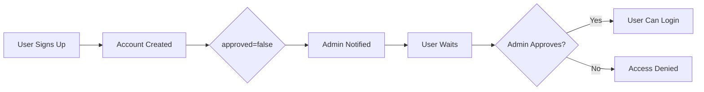

# 🎯 Authentication System & Deployment Summary

## 📋 What We Discovered

### **Your Current Authentication System**

**Flow:** Registration → Admin Approval Required → Login → Access



**Protection Mechanism:**

-   `backend/src/routes/auth.ts` creates users with `approved: false`
-   `backend/src/middleware/auth.ts` blocks access if `approved !== true`
-   Only ADMIN role bypasses approval check

**Key Fields:**

-   `active` (Boolean) - Account enabled/disabled
-   `approved` (Boolean) - Admin approval status
-   `emailVerified` (Boolean) - Email confirmation
-   `role` (Enum) - USER, STAFF, ADMIN, SUPERADMIN

---

## 🆓 How to Enable Free User Sign-In

### **Recommended: Option 1 - Auto-Approve (Simplest)**

**Change 1 line in registration:**

```typescript
// backend/src/routes/auth.ts - Line 56
approved: true, // ✅ Change from false
```

**Result:** Users can sign up → login → immediate access

---

### **Alternative: Option 2 - Email Verification Only**

**Remove approval check, enforce email verification:**

```typescript
// backend/src/middleware/auth.ts - Replace lines 80-109
if (!user.emailVerified && user.role !== "ADMIN") {
  return res.status(403).json({
    error: "Email verification required",
    message: "Please verify your email to access the platform.",
  });
}
```

**Result:** Users must verify email before access (industry standard)

---

### **Advanced: Option 3 - Freemium Model**

**Add subscription tiers with feature limits:**

```typescript
// Free tier gets:
✅ Breach monitoring (5 checks/day)
✅ IP rotation (10 rotations/day)
✅ Support chat
❌ Priority support (Pro only)
❌ Advanced analytics (Pro only)
```

See `AUTH_SYSTEM_ANALYSIS.md` for full implementation guide.

---

## 🚨 Current Deployment Status

### **Backend: ❌ DOWN**

```
URL: https://api.advanciapayledger.com/api/health
Status: 502 Bad Gateway
Issue: Render service not responding
```

**Likely Causes:**

1. Service sleeping (free tier timeout)
2. Database connection failed
3. Missing environment variables
4. Build error

**Fix:**

1. Go to <https://dashboard.render.com>
2. Find your backend service
3. Click "Manual Deploy" → "Clear build cache & deploy"
4. Wait 5-10 minutes
5. Test health endpoint

---

### **Frontend: ⏳ Not Tested**

```
URL: https://advanciapayledger.com
Expected: Vercel deployment
```

---

## 🗄️ Database Migration Required

### **New Models Added to schema.prisma:**

1. **BreachAlert** - Stores data breach monitoring results
2. **IPRotationLog** - Logs IP rotation activity
3. **SecuritySettings** - User security preferences
4. **SubscriptionTier** - Enum for FREE/STARTER/PRO/ENTERPRISE

### **Run Migration:**

```powershell
cd backend
npx prisma migrate dev --name add_security_features
npx prisma generate
npx prisma studio # Verify tables created
```

---

## ✅ What's Already Built

### **1. Breach Alert System** `/security/breach-alert`

-   Shows 317 data breaches (demo)
-   Email breach list with counts
-   Detailed leak sources
-   24/7 monitoring activation
-   Protection recommendations

### **2. IP Protection System** `/security/ip-protection`

-   Current IP display (197.211.52.75 → Nigeria)
-   Country selector (US, UK, DE, FR, CA, AU, JP, SG)
-   IP rotation with random generation
-   VPN/Proxy/Location masking toggles
-   Protection status (Unprotected/Protected)

### **3. Support System** `/support`

-   Comprehensive ticket form
-   Floating chat widget (bottom-right)
-   Quick action buttons
-   File upload support
-   VeePN-style footer

### **4. Backend API Routes** `/api/security`

-   `GET /breach-check` - Check email for breaches
-   `POST /activate-monitoring` - Enable 24/7 monitoring
-   `POST /rotate-ip` - Rotate IP to target country
-   `GET /ip-info` - Get current client IP

### **5. Navigation Integration**

-   🛡️ Breach Alert link
-   🌍 IP Protection link
-   💬 Support link
-   All in SidebarLayout.tsx

---

## 🧪 Testing Steps

### **Step 1: Fix Backend**

```powershell
# Test health endpoint
Invoke-RestMethod -Uri "https://api.advanciapayledger.com/api/health"
```

### **Step 2: Test Auth Flow**

```powershell
# Register user (see DEPLOYMENT_TEST_CHECKLIST.md for full script)
$registerData = @{
    email = "test@example.com"
    password = "Test123456!"
} | ConvertTo-Json

Invoke-RestMethod -Uri "https://api.advanciapayledger.com/api/auth/register" `
    -Method POST -Body $registerData -Headers @{"x-api-key" = "dev-key"}
```

### **Step 3: Test Security Features**

1. Navigate to <https://advanciapayledger.com/security/breach-alert>
2. Click email to view breach sources
3. Click "Activate" button
4. Navigate to /security/ip-protection
5. Select "United States"
6. Click "Rotate IP Now"
7. Verify new IP displays

---

## 📁 Documentation Files Created

1. **AUTH_SYSTEM_ANALYSIS.md** (4,500+ words)
   -   Current auth system explained
   -   3 implementation options for free access
   -   Freemium model guide
   -   Subscription tier implementation
   -   Database schema changes
   -   Migration guide

2. **DEPLOYMENT_TEST_CHECKLIST.md** (3,000+ words)
   -   Backend troubleshooting
   -   Database migration steps
   -   Complete testing protocol
   -   PowerShell test scripts
   -   Expected responses
   -   Troubleshooting guide

3. **SECURITY_FEATURES_GUIDE.md** (Existing)
   -   HIBP API integration
   -   ProxyMesh/Luminati setup
   -   Production deployment

4. **backend/prisma/migrations/add_security_features.sql**
   -   SQL migration script
   -   Creates 3 new tables
   -   Adds indexes

5. **backend/prisma/schema.prisma** (Updated)
   -   BreachAlert model
   -   IPRotationLog model
   -   SecuritySettings model
   -   SubscriptionTier enum

---

## 🎯 Next Actions (Priority Order)

### **🔴 Critical - Do First:**

1. **Fix Backend Deployment**
   -   Check Render dashboard
   -   Restart service
   -   Verify environment variables
   -   Test `/api/health` endpoint

2. **Choose Auth Model**
   -   Option 1: Auto-approve (change 1 line)
   -   Option 2: Email verification only
   -   Option 3: Freemium with limits

3. **Update Auth Code**
   -   Edit `backend/src/routes/auth.ts`
   -   OR edit `backend/src/middleware/auth.ts`
   -   Commit and deploy

### **🟡 Important - Do Next:**

4. **Run Database Migration**

   ```bash
   cd backend
   npx prisma migrate dev --name add_security_features
   ```

5. **Test Full Flow**
   -   Register → Login → Access features
   -   Test breach alert page
   -   Test IP protection page
   -   Test support chat

### **🟢 Optional - Do Later:**

6. **Production API Integration**
   -   HIBP API ($3.50/month)
   -   ProxyMesh ($10/month)

7. **Monitoring Setup**
   -   Sentry error tracking
   -   Usage analytics
   -   Performance monitoring

---

## 💡 Key Insights

### **Your System vs. Standard SaaS:**

| Feature    | Your System             | Standard SaaS           | Impact             |
| ---------- | ----------------------- | ----------------------- | ------------------ |
| Sign-up    | Admin approval required | Email verification only | Blocks user access |
| Free tier  | None (manual approval)  | Immediate with limits   | No free users      |
| Onboarding | Wait for admin          | Instant access          | Poor UX            |

### **Comparison with VeePN (Your Inspiration):**

VeePN allows:

-   ✅ Instant sign-up (free trial)
-   ✅ Immediate feature access
-   ✅ Breach monitoring (free)
-   ✅ IP masking (paid)

Your system currently:

-   ❌ Requires admin approval
-   ❌ No free access
-   ✅ Better security features
-   ✅ More comprehensive dashboard

### **Recommended Configuration:**

```typescript
// Best for MVP launch
approved: true,           // Auto-approve
emailVerified: false,     // Require email verification
subscriptionTier: "FREE", // Default to free tier
subscriptionStatus: "active"
```

**Free Tier Limits:**

-   5 breach checks/day
-   10 IP rotations/day
-   Support chat access
-   1,000 API calls/month

**Pro Tier ($9.99/month):**

-   Unlimited breach monitoring
-   Unlimited IP rotations
-   Priority support
-   Advanced analytics

---

## 📊 System Architecture

```
Frontend (Vercel)
    ↓
  API Gateway
    ↓
Backend (Render)
    ↓
PostgreSQL (Render/Supabase)

Security Features:
├── Breach Monitoring (HIBP API)
├── IP Rotation (ProxyMesh)
├── Support Chat (Internal AI)
└── Real-time Notifications (Socket.IO)
```

---

## 🔑 Environment Variables Checklist

```env
# Backend (Render)
DATABASE_URL=postgresql://...
JWT_SECRET=minimum-32-characters-secret
STRIPE_SECRET_KEY=sk_test_...
CRYPTOMUS_API_KEY=...
CRYPTOMUS_MERCHANT_ID=...
EMAIL_USER=yourapp@gmail.com
EMAIL_PASSWORD=gmail-app-password
VAPID_PUBLIC_KEY=...
VAPID_PRIVATE_KEY=...

# Optional Production APIs
HIBP_API_KEY=... ($3.50/month)
PROXY_USERNAME=... (ProxyMesh)
PROXY_PASSWORD=...
SENTRY_DSN=... (error tracking)
```

---

## 📞 Support Resources

-   **Auth Analysis:** `AUTH_SYSTEM_ANALYSIS.md`
-   **Testing Guide:** `DEPLOYMENT_TEST_CHECKLIST.md`
-   **Security Setup:** `SECURITY_FEATURES_GUIDE.md`
-   **Migration SQL:** `backend/prisma/migrations/add_security_features.sql`

---

## ✨ Summary

**What You Have:**

-   ✅ Complete breach monitoring system
-   ✅ IP protection with country selection
-   ✅ Professional support system
-   ✅ All features in navigation
-   ✅ Database models ready
-   ✅ Backend API routes ready

**What You Need:**

-   ⚠️ Fix backend deployment (502 error)
-   ⚠️ Enable free user access (1-line change)
-   ⚠️ Run database migration
-   ⚠️ Test end-to-end

**Total Implementation Time:**

-   Auth change: 5 minutes
-   Database migration: 10 minutes
-   Backend restart: 10 minutes
-   Testing: 30 minutes
-   **Total: ~1 hour to launch** 🚀
